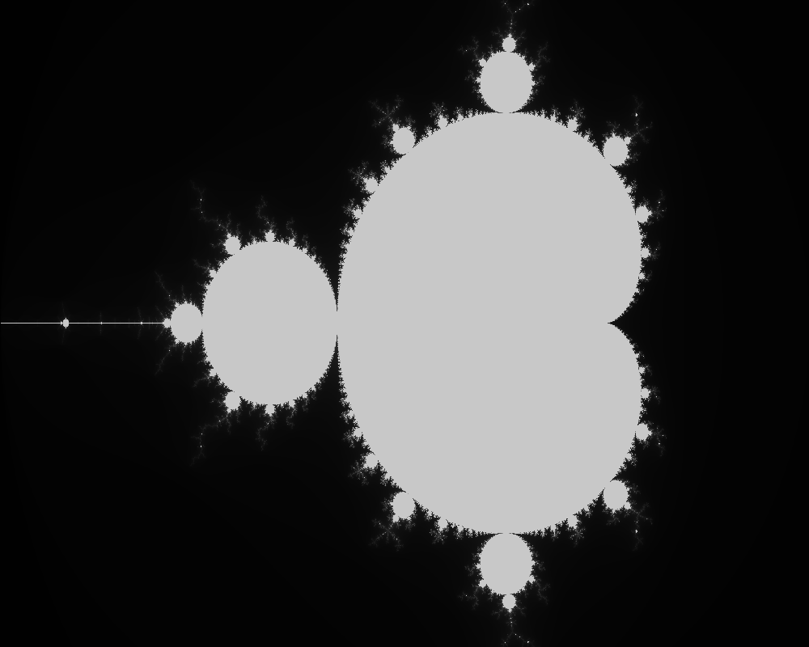

# Mandelbrot fractal

## Demonstration


### Image

## Description
This is the program that draws this fractal in bmp. <br>

In fact, we can divide the algorithm into 2 parts:
- BMP format handeling
- calculating the fractal

### BMP
First, it creates bmp headers in a file. In other words, metadata is inserted in the beginning. Then we calculate the value of a fractal and apply % 256 to map onto grayscale. It is worth noting that there is a padding in bmp file: the row size should be a multiple of 4 bytes. Then, the formula to calculate RowSize in bytes is the following:

$\large RowSize = \lceil \frac{BitsPerPixel \times ImageWidth }{32} \rceil \times 4 = \lfloor \frac{BitsPerPixel \times ImageWidth + 31}{32} \rfloor \times 4$ 

To get padding, we subtract the lenght in bytes without padding $ width \times 3$.

### Calculations
In a nutshell, we count how much iterations completed in converging complex number $z$ by the following formula

Mapping formula to fit into format:

$\large return \ (value - in_{min})\times(out_{max} - out_{min}) / (in_{max} - in_{min})$,
where
- $value$ that we want to map
- $in_{min/max}$ - borders in which we want to map real or imaginary part(when we choose width or height concordantly), e. g. $[-2, 1]$
- $out_{min/max}$ - in pixels. If we want to plot between 0 and 512 pixels, we have to set $out_{min} = 0$ and $out_{max} = 512$

And the "convergence" formula here: 

$\large z \leftarrow z^2 + c$, where
- $c = currentWidth +  currentHeight \times i$
- $z = 0 + 0i$ from the beginning

while $magnitude(z) < 4 \ AND \ iterations < maxIterations$

## Installation
First, copy the repository and run there cmake as follows:
```
git clone https://github.com/AndrewChmutov/CMandelbrot
cd CMandelbrot
cmake -S . -B build
```
It will make configurations for compilation.<br>
Then, go to directory 'build' and compile it:
```
cd build
make
```

---

## How to use

Template for using the program is:

```
./mandelbrot WIDTH HEIGHT PATH-TO-BMP